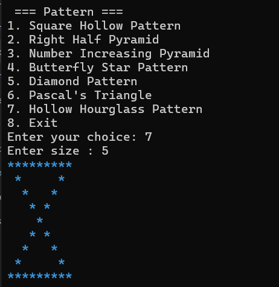

# 🌟 Pattern Printer in C++

A fun, menu-driven C++ console app that prints classic and advanced star & number patterns — **now in color!**  
Perfect for beginners to learn loops, conditions, modular code *and* adding a polished console look.

---

## 🎨 New: Colored patterns!
Each pattern is printed in its own color (green, blue, cyan, magenta, etc.)  
This makes the output more fun, readable, and impressive — especially when sharing or demoing.

*(Uses ANSI escape codes, supported by most modern terminals like Linux/macOS and Windows 10+)*

## **All pattern outputs**

Below are examples of all 7 patterns printed by this program, each in its own color.

▶ Click to expand all screenshots

### Square Hollow Pattern (Easy Star)

---

### Right Half Pyramid (Easy Star)

---

### Number Increasing Pyramid (Easy Number)

---

### Butterfly Star Pattern (Medium Star, Symmetrical)

---

### Diamond Pattern (Medium Star, Symmetrical)

---

### Pascal's Triangle (Medium+ Number, Combinatorial)

---

### Hollow Hourglass Pattern (Advanced Star)

  <em>✨ Thank you for checking out this project — happy coding and keep exploring creative patterns! ✨</em>

